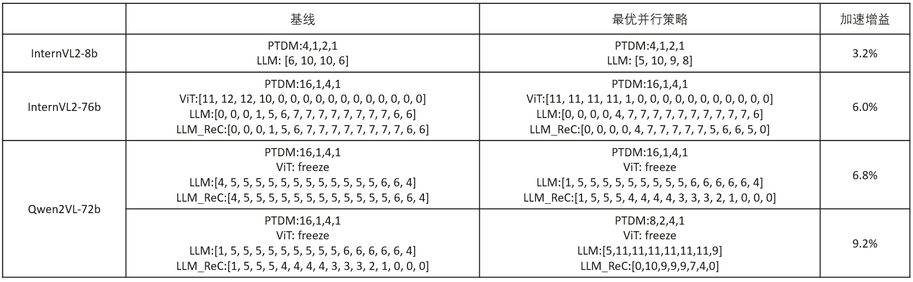

## Automatic Parallelism For Multi-Modal

## 问题分析
当前多模态大模型的并行训练方法越来越丰富，主要有TP\PP\DP\CP\VPP等，每种并行方法在计算、内存、通信上均有不同的优势。在当前的生产过程中，主要是使用基于专家经验的人工调优，一般需要数天甚至数周的时间。相似模型或者一个模型的不同训练阶段，最优的并行配置也并不相同。随着并行方法的不断丰富，并行搜索空间不断变大，使用人工调优的方法变得越来越不可行。因此需要构建一个面向多模态大模型的并行配置自动调优算法，可以自动化得根据集群资源、模型结构得出最优的并行方法。

## 解决方案
针对多模态大模型结构丰富，训练阶段多样的特点，我们将网络进行切分和子图归并，然后使用基于黑盒Profiling的方法对多种并行配置采样，最后使用基于整数规划的方法进行非均匀的网络层切分：

- 采样性能：
遵照多模态大模型原有的训练方法和调用逻辑，将模型进行切分和子图归并，然后使用少量资源进行block级别的性能采样，这样的采样方案兼顾了子图外推的灵活性和采样操作低开销的要求。
- 端到端建模：
根据性能采样得到的子图性能、内存数据，使用白盒建模的方法得到网络的峰值内存，以及仿真得到的单步迭代时间。
- 并行策略调优：
根据集群的资源和模型支持的并行策略，构建全量的并行策略搜索空间；针对每种并行策略，将PP非均匀层最优切分问题转化为整数规划问题，联合考虑PP流水调度、内存限制和重计算策略，优化目标为端到端时间最短。遍历所有可行的并行策略，得到最优的并行方案；


## 适配版本
MindSpeed-Core branch: core_r0.8.0


## 使用方法
在使用多维自动并行特性时，**需使用python作为脚本启动器，在所有的节点上拉起脚本**，并配置多维自动并行相关的参数。相关参数及其函数如下表所示：

| 参数名                      | 参数含义                                            |
| --------------------------- | -------------------------------------------------- |
| --auto-parallel-mm          | 多维自动并行特性总开关                               |
| --nnodes                    | 采样集群中节点的个数                                 |
| --nproc-per-node            | 采样集群中每个节点计算设备的个数                     |
| --master-addr               | 采样集群中主节点的IP地址                             |
| --master-port               | 采样集群用于通信的端口号，各节点需要配置相同的端口    |
| --node-rank                 | 采样集群中节点的rank，主节点为0，其他节点为1,2,······ |
| --simulated-nnodes          | 待训练集群的节点个数                                 |
| --simulated-nproc-per-node  | 待训练集群每个节点的设备数                           |

下面是基于Qwen2VL-72B模型的配置示例：
```shell
#!/bin/bash
export ASCEND_SLOG_PRINT_TO_STDOUT=0
export ASCEND_GLOBAL_LOG_LEVEL=3
export TASK_QUEUE_ENABLE=2
export COMBINED_ENABLE=1
export CPU_AFFINITY_CONF=2
export HCCL_CONNECT_TIMEOUT=1200
export NPU_ASD_ENABLE=0
export ASCEND_LAUNCH_BLOCKING=0
export HOST_CACHE_CAPACITY=20
export ACLNN_CACHE_LIMIT=100000
export MULTI_STREAM_MEMORY_REUSE=2
export PYTORCH_NPU_ALLOC_CONF="expandable_segments:True"
# 根据机器实际情况填写
NPUS_PER_NODE=8
MASTER_ADDR=localhost
MASTER_PORT=6010
NODE_RANK=0
NNODES=1
WORLD_SIZE=$(($NPUS_PER_NODE*$NNODES))
echo $MASTER_ADDR
echo $NODE_ADDR
echo $NODE_RANK
echo $NNODES


MM_DATA="./examples/qwen2vl/data_72b.json"
MM_MODEL="./examples/qwen2vl/model_72b.json"
MM_TOOL="./mindspeed_mm/tools/tools.json"
LOAD_PATH="ckpt/Qwen2-VL-72B-Instruct"
SAVE_PATH="save_dir"

TP=4
PP=2
CP=1
MBS=1
GRAD_ACC_STEP=32
DP=$(($WORLD_SIZE/$TP/$PP/$CP))
GBS=$(($MBS*$GRAD_ACC_STEP*$DP))

DISTRIBUTED_ARGS="
    --nproc_per_node $NPUS_PER_NODE \
    --nnodes $NNODES \
    --node_rank $NODE_RANK \
    --master_addr $MASTER_ADDR \
    --master_port $MASTER_PORT
"

GPT_ARGS="
    --use-mcore-models \
    --tensor-model-parallel-size ${TP} \
    --pipeline-model-parallel-size ${PP} \
    --micro-batch-size ${MBS} \
    --global-batch-size ${GBS} \
    --num-layers 80 \
    --hidden-size 8192 \
    --ffn-hidden-size 29568 \
    --num-attention-heads 64 \
    --tokenizer-type NullTokenizer \
    --vocab-size 152064 \
    --seq-length 8192 \
    --max-position-embeddings 32768 \
    --make-vocab-size-divisible-by 1 \
    --init-method-std 0.01 \
    --normalization RMSNorm \
    --use-fused-rmsnorm \
    --swiglu \
    --use-fused-swiglu \
    --lr 1.0e-5 \
    --lr-decay-style cosine \
    --weight-decay 0 \
    --train-iters 5 \
    --lr-warmup-fraction 0.1 \
    --clip-grad 0.0 \
    --adam-beta1 0.9 \
    --adam-beta2 0.999 \
    --no-gradient-accumulation-fusion \
    --no-load-optim \
    --no-load-rng \
    --no-save-optim \
    --no-save-rng \
    --seed 42 \
    --bf16 \
    --load $LOAD_PATH \
    --variable-seq-lengths \
    --enable-one-logger \
    --use-distributed-optimizer \
    --reuse-fp32-param
"

MM_ARGS="
    --mm-data $MM_DATA \
    --mm-model $MM_MODEL \
    --mm-tool $MM_TOOL
"

SEARCH_ARGS="
    --auto-parallel-mm \
    --nnodes $NNODES \
    --nproc-per-node $NPUS_PER_NODE \
    --master-addr $MASTER_ADDR \
    --master-port $MASTER_PORT \
    --node-rank $NODE_RANK \
    --simulated-nnodes 8 \
    --simulated-nproc-per-node 16 \
"

OUTPUT_ARGS="
    --log-interval 1 \
    --save-interval 10000 \
    --eval-interval 10000 \
    --eval-iters 5000 \
    --save $SAVE_PATH \
"
logfile=$(date +%Y%m%d)_$(date +%H%M%S)
mkdir -p logs

python pretrain_vlm.py \
    $GPT_ARGS \
    $MM_ARGS \
    $OUTPUT_ARGS \
    $SEARCH_ARGS \
    --distributed-backend nccl \
    | tee logs/train_${logfile}.log 2>&1

chmod 440 logs/train_${logfile}.log
```

## 调优效果




## 搜索结果说明

- 当前已支持多模态理解模型PP/TP/DP/MBS维度以及PP非均匀层切分维度的最优搜索
- 搜索算法的调优结果会存放在执行目录下的 auto_parallel_search_optimal_config.json 文件中，以下表格是对搜索结果的解释

| 参数名                      | 参数含义                                            |
| --------------------------- | -------------------------------------------------- |
| parallel_config             | 并行配置，包含PP/TP/DP/MBS维度                      |
| layer_placement             | 层切分配置，其中包含ViT及LLM的PP层切分策略           |
| layer_recompute             | 细粒度重计算层数，包含ViT及LLM的重计算层数           |
| e2e_time                    | 仿真的端到端时间                                    |
| throughput                  | 仿真的模型吞吐率                                    |

- 以下是Qwen2VL-72B模型的最优并行策略搜索结果示例：
```json
{
    "parallel_config": {
        "PP": 8,
        "TP": 2,
        "DP": 4,
        "MBS": 1
    },
    "layer_placement": {
        "vit_layer_placement": [32, 0, 0, 0, 0, 0, 0, 0],
        "llm_layer_placement": [5, 11, 11, 11, 11, 11, 11, 9]
    },
    "layer_recompute": {
        "vit_layer_recompute": [0, 0, 0, 0, 0, 0, 0],
        "llm_layer_recompute": [0, 10, 9, 9, 9, 7, 4]
    },
    "e2e_time": 8992.0,
    "throughput": 761.58192090395477
}
```
