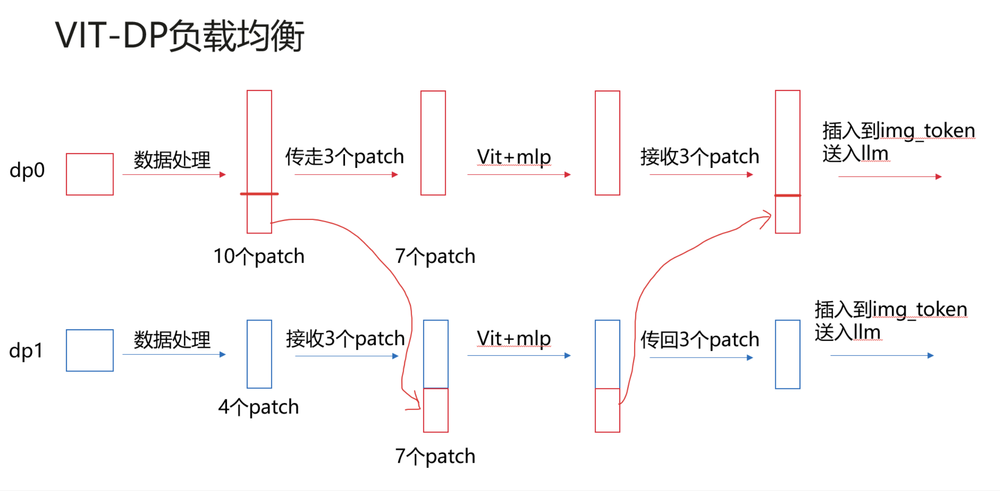

# Encoder数据负载均衡 (beta)

## 问题分析

以Internvl为例，DP大于1时，DP间处理的图片patch数不同，vit和mlp计算量差异大，导致训练时在梯度allreduce处快卡等慢卡。

## 解决方案

Alltoall通信，多patch的DP传给少patch的DP，实现encoder的负载均衡。


## 使用方法

1. 在模型启动 shell 中添加参数（当前仅支持InternVL）；

   ```shell
   GPT_ARGS="
       ...
       --encoder-dp-balance \
   "
   ```
