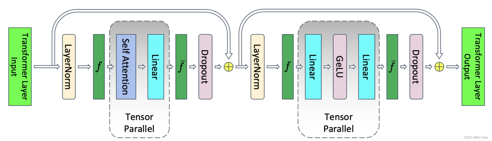

# Qwen2VL-72B支持非均匀Sequence Parallel切分 

## 问题分析

SP（Sequence Parallel）并行算法是一种针对长序列数据处理的并行化技术，在处理长序列时具有显著优势。多模态模型存在大量序列长度非均匀场景，需要进行相应的适配。

## 解决方案

Sequence Parallel主要作用与TransformerLayer中的Dropout和LayerNorm模块，在序列维度对数据进行非均匀切分。



## 使用方法
(当前仅支持qwen2vl)
1. examples/qwen2vl/model_72b.json中的image_encoder.vision_encoder添加sequence_parallel,tensor_parallel,variable_seq_lengths三个选项，并设置为true，添加tensor_model_parallel_size选项，设置为实际的tp值；

2. examples/qwen2vl/model_72b.json中的text_decoder添加的选项和上一条相同；

3. examples/qwen2vl/finetune_qwen2vl_72b.sh中的GPT_ARGS添加  
```shell
    --sequence-parallel
    --unaligned-linear 
```
并保证该shell脚本中的tp值与上两条中的tp值保持一致。

