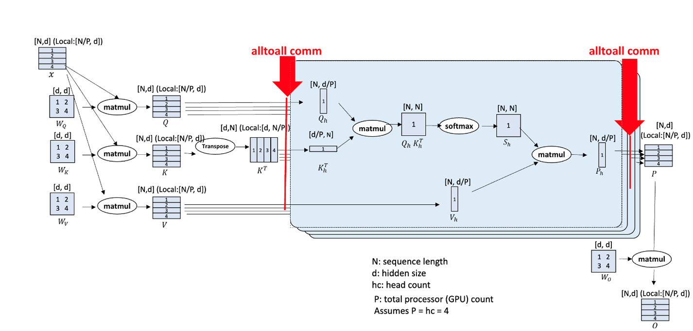

# Qwen2VL-72B支持非均匀Ulysses CP切分 

## 问题分析

CP（Context Parallel）并行算法是一种针对长序列数据处理的并行化技术，在处理长序列时具有显著优势。多模态模型存在大量序列长度非均匀场景，需要进行相应的适配。

## 解决方案

Ulysses CP算法基于All2All算子，对All2All算子的Input List与Output List根据序列长度进行非均匀切分，使能Ulysses算法。



## 使用方法
(当前仅支持qwen2vl)
1. examples/qwen2vl/model_72b.json中的image_encoder.vision_encoder添加context_parallel_size选项，并设置CP大小；

2. examples/qwen2vl/model_72b.json中的text_decoder添加context_parallel_size选项，并设置CP大小；

3. examples/qwen2vl/finetune_qwen2vl_72b.sh中的GPT_ARGS添加  
```shell
    --context-parallel-size ${CP} 
```

上述三处的CP大小保持一致

4. examples/qwen2vl/finetune_qwen2vl_72b.sh中的GPT_ARGS添加  
```shell
    --context-parallel-algo ulysses_cp_algo
```
默认CP算法即ulysses_cp_algo，该参数可以不添加
