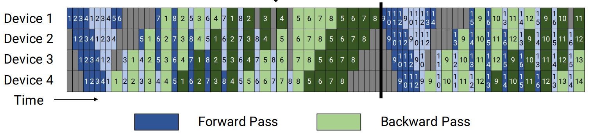

# 虚拟流水线并行

## 问题分析

Pipedream流水线并行切分粒度过大，运行过程中仍然有许多空泡(bubble)，计算资源利用率仍有提高空间。

## 解决方案

将计算进一步细分，减少空泡。

### 解决思路:

在设备数量不变的情况下，分出更多的流水线阶段，以更多的通信量，换取空泡比率降低。



[原文链接](https://people.eecs.berkeley.edu/~matei/papers/2021/sc_megatron_lm.pdf)

为了方便理解，举一个例子：Internvl2-8B的视觉模块层数是24，语言模块层数是32。设置张量并行大小为1，流水线并行大小为4，虚拟流水线并行大小为3。模型会被分为 4 * 3 = 12 个阶段，其中每个阶段的层数可自定义，支持非均匀切分。

视觉模块的切分方式：`[[6, 7, 7, 4],[0, 0, 0, 0],[0, 0, 0, 0]]`，

语言模块的切分方式：`[[0, 0, 0, 1],[4, 4, 4, 4],[4, 4, 4, 3]]`

下面为每个device和每层vpp的模型层数分布，D表示Device，V表示vpp

    D0V0: 6层vit + 0层llm
    D0V1: 0层vit + 4层llm
    D0V2: 0层vit + 4层llm
    D1V0: 7层vit + 0层llm
    D1V1: 0层vit + 4层llm
    D1V2: 0层vit + 4层llm
    D2V0: 7层vit + 0层llm
    D2V1: 0层vit + 4层llm
    D2V2: 0层vit + 4层llm
    D3V0: 4层vit + 1层llm
    D3V1: 0层vit + 4层llm
    D3V2: 0层vit + 3层llm

前向的顺序为 D0V0 -> D1V0 -> D2V0 -> D3V0 -> D0V1 -> D1V1 -> D2V1 -> D3V1 -> D0V2 -> D1V2 -> D2V2 -> D3V2

## 使用场景

想要进一步减小空泡比率，提升性能

## 使用方法

以Internvl2-8B为例

1.运行权重切分脚本时，vpp设置为True

```shell
python examples/internvl2/internvl2_convert_to_mm_ckpt.py --model-size 8B --vpp True --load-dir load_path --save-dir save_path --trust-remote-code True
```

2.修改model.json中的pipeline_num_layers，需要和权重转换时的layers一致。可参考examples/internvl2/model_8B_vpp.json

```
# text_decoder
"pipeline_num_layers": [[0, 0, 0, 1],[4, 4, 4, 4],[4, 4, 4, 3]]

# vision_encoder
"pipeline_num_layers": [[6, 7, 7, 4],[0, 0, 0, 0],[0, 0, 0, 0]]
```

3.shell添加vpp参数，可参考examples/internvl2/finetune_internvl2_8B_vpp.sh。因为megatron原生只支持vpp均匀切分，为了支持vpp非均匀切分，需要在shell中导入VP_SIZE变量，VP_SIZE等于pipeline_num_layers的长度；`--num-layers-per-virtual-pipeline-stage 2`该参数仅用于开启vpp功能，需设置成大于1的整数，在初始化通信组时不会用到

```shell
export VP_SIZE=3
GPT_ARGS="
    --num-layers-per-virtual-pipeline-stage 2
    ..."
```


## 使用效果

空泡比率进一步减小

## 注意事项

1.MindSpeed-MM对vpp进行了优化，支持不均匀切分。用户可对权重转换脚本、model.json和shell进行修改，自定义vpp切分方式

2.Megatron虚拟流水并行vpp影响权重切分方式，保存、加载权重时需保证vpp配置一致，才能正常加载
