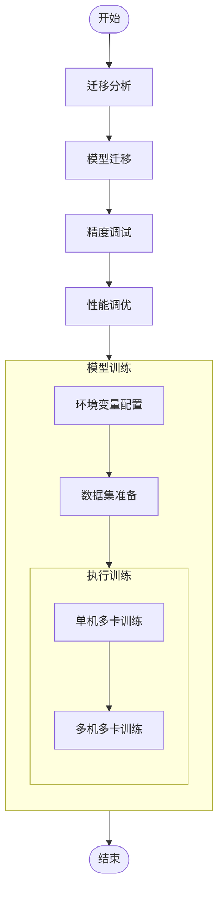
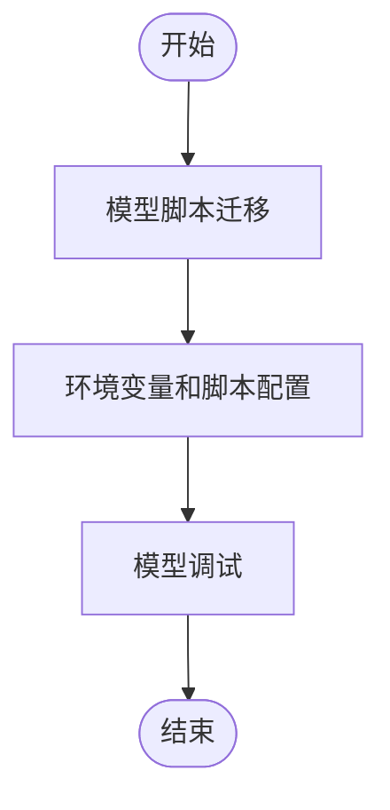

# MindSpeed MM迁移调优指南

## 概述
MindSpeed MM是面向大规模分布式训练的昇腾多模态大模型套件，同时支持多模态生成及多模态理解，旨在为华为昇腾芯片提供端到端的多模态训练解决方案, 包含预置业界主流模型，数据工程，分布式训练及加速，预训练、微调、在线推理任务等特性。

MindSpeed MM基于华为昇腾芯片产品（NPU）开发，并对昇腾芯片进行极致优化以发挥芯片最大性能。

本手册面向的读者主要是具有一定深度学习基础与编程经验的研究人员、工程师和开发者：

- 了解深度学习的基本概念和技术，能够使用Python编程语言、Megatron-LM框架进行深度学习模型开发和调试；

- 对深度学习模型的训练和优化有一定的了解，包括训练任务执行与评估，分布式训练，性能数据采集及分析等；

- 对常见的系统性能优化手段有基本认知，例如并行化、编译优化等。

**什么是模型迁移**

模型迁移是指将原本运行在GPU或其他硬件平台的深度学习模型迁移至NPU，
并保障模型在合理精度误差范围内高性能运行。

**为什么进行模型迁移**

将模型从其他硬件平台迁移到NPU时，
由于硬件架构和库的不同，涉及到一系列底层到上层的适配操作。
以GPU为例，模型迁移至NPU需要适配的原因可分为三方面：

- 硬件特性和性能特点差异
由于NPU和GPU的硬件特性和性能特点不同，
模型在NPU上可能需要进一步的性能调试和优化，以充分发挥NPU的潜力。

- 计算架构差异
NVIDIA GPU采用CUDA（Compute Unified Device Architecture）的并行计算架构，
而华为NPU采用CANN（Compute Architecture for Neural Networks）的异构计算架构。

- 深度学习框架差异
为了支持NPU硬件，需要通过`MindSpeed`对`Megatron-LM`框架进行适配：包括适配张量运算、自动微分等功能，以便在NPU上高效执行。

## 模型迁移总体流程
通用模型迁移适配方法，可以分为四个阶段：迁移分析、模型迁移、精度调试与性能调优，总体流程如下图所示。


## 迁移分析
建议用户在选取迁移模型时，尽可能选取权威PyTorch模型实现仓，包括但不限于PyTorch（imagenet/vision等）、Meta Research（Detectron/detectron2等）、open-mmlab（MMDetection/mmpose等）。

对于大模型，使用较为广泛的资源仓库是HuggingFace、Megatron-LM、Llama-Factory等仓库，可以在其中选取目标模型。

**约束说明**
在进行模型迁移前，需要了解如下模型迁移约束，评估当前模型迁移的可行性，完成迁移前的环境准备：

迁移前要保证选定的模型能在三方平台（如GPU）上运行，并输出精度和性能基线。
模型迁移前需要参考[《Ascend Extension for PyTorch 软件安装指南》](https://www.hiascend.com/document/detail/zh/Pytorch/700/configandinstg/instg/insg_0001.html)完成昇腾PyTorch训练环境安装，以便完成迁移支持度分析与后续的模型训练，包括NPU驱动和固件、CANN软件（Toolkit、Kernels和NNAL）、以及PyTorch框架和torch_npu插件的安装。
目前已知的不支持场景：

当前不支持使用DP（Data Parallel，数据并行）模式的模型迁移。若用户训练脚本中包含NPU平台不支持的torch.nn.parallel.DataParallel接口，则需手动修改该接口为torch.nn.parallel.DistributedDataParallel接口，以执行多卡训练。原脚本需要在GPU环境下基于Python3.8及以上跑通。
APEX库中的FusedAdam融合优化器，目前不支持使用自动迁移或PyTorch GPU2Ascend工具迁移该优化器，需用户手工进行迁移，具体修改方法可单击[Link](https://gitee.com/ascend/apex#apexoptimizers)。
大模型迁移暂不支持bmtrain框架的迁移。
bitsandbytes已支持在昇腾上进行安装，具体可单击[Supported Backends](https://github.com/bitsandbytes-foundation/bitsandbytes/blob/main/docs/source/installation.mdx#supported-backendsmulti-backend-supported-backends)进行参考，目前仅支持NF4量化/反量化迁移，用于LLM QLoRA微调，其余功能暂不支持。
大模型迁移暂不支持colossai三方库中HybridAdam优化器相关接口的迁移。
目前暂不原生支持xFormers训练，如需使用xFormers中的[FlashAttentionScore](https://www.hiascend.com/document/detail/zh/Pytorch/700/ptmoddevg/trainingmigrguide/performance_tuning_0034.html)融合算子的迁移，用户可参考FlashAttentionScore章节进行替换。
当前NPU不支持grouped_gemm第三方库安装。
当前NPU支持composer第三方库安装，但NPU未做适配，无法使用。

## 模型迁移
模型迁移流程总体可分为模型脚本迁移、环境变量和脚本配置和关键特性适配三部分，主要包含以下工作：

- **模型脚本迁移**：脚本迁移分为两块，首先，需要把三方平台上的PyTorch模型代码映射到昇腾设备上。推荐使用自动迁移，通过导入transfer_to_npu一键式迁移代码，将三方平台上的代码映射为昇腾设备代码。其次，MindSpeed MM作为分布式框架，代码实现与原始仓库中DeepSeed和FSDP等框架存在差异，需要熟悉算法实现原理，进行针对性的迁移。
- **环境变量和脚本配置**：介绍在昇腾设备上运行PyTorch模型代码时，必须的适配操作，包括训练前环境变量配置和模型脚本与启动脚本配置。
- **模型调试**：在进行迁移和变量适配，应按步骤进行对应调试，从单模块到全流程，依次进行。

总体流程如下：


## 精度调优
训练一个大模型，往往涉及到高额的成本投入与复杂的技术难题。例如，MetaAI公开了OPT-175B大模型的训练日志，披露了从2021-10-20到2022-01-06之间75天内训练大模型遇到的各种问题以及应对方案。这些问题非常有代表性：例如大量硬件失效，需要移除出错节点、排查软件栈错误后重启训练；再比如出现Loss上扬、梯度范数异常等棘手的问题，需要调整学习率、batch尺寸，或者跳过异常训练语料来解决或规避。从上述示例中可以看出，即使在最先进、最主流的AI加速器上，训练大模型仍需克服诸多难关。除了OPT-175B，AI2发布了OLMo系列模型的技术报告、数据、权重、超参数，甚至公开了处理数据、评估模型的代码以及训练日志。OLMo即便只是7B参数的语言模型，涉及到的细节仍然非常繁杂，例如混合精度配置、数据处理、大量训练内部状态监控等。

总的来说，训练本身是一种研发行为，受数据集、模型结构、并行策略、超参等影响，模型训练过程中可能出现NaN、溢出、Loss发散等情况，这时需要对模型进行精度调试。在昇腾处理器上训练模型时，一般而言Loss总体呈现下降收敛趋势，即使出现偶尔的尖刺现象也可以通过跳过数据集、断点续训等方式规避。最终，当使用训练后得到的权重，采用常规数据集评估模型分数是否符合社区实践评分预期，即可视为精度调试已完成。


## 性能调优
在MindSpeed MM中，提供了计算、通信和下发等多项性能优化手段。

### 下发优化
**一级流水优化**
一级流水优化是一种通用有效的优化方法，主要是将部分算子适配任务迁移至二级流水，使两级流水负载更均衡，并减少dequeue唤醒时间。

使能说明

该特性可以通过环境变量设置，一般用于以下场景：host-bound严重的网络场景。

使用方法如下：
```
export TASK_QUEUE_ENABLE=2
```

**绑核优化**
在PyTorch的训练或推理场景，可以通过设置环境变量CPU_AFFINITY_CONF来控制CPU端算子任务的处理器亲和性，即设定任务绑核。该配置能够优化任务的执行效率，避免跨 NUMA（非统一内存访问架构）节点的内存访问，减少任务调度开销。

可选的绑核方案如下：

- 粗粒度绑核：将所有任务绑定在NPU对应NUMA的CPU核心上，避免跨NUMA节点的内存访问，并支持粗粒度绑核上的自定义绑核。
- 细粒度绑核：在粗粒度绑核的基础上进一步优化，将主要任务锚定在NUMA节点的某固定CPU核心上，减少核间切换的开销。
```
export CPU_AFFINITY_CONF=<mode>,npu<value1>:<value2>-<value3>
```
可选参数设置：

\<mode>绑核模式，取值如下：
- 0或未设置：表示不启用绑核功能。
- 1：表示开启粗粒度绑核。
- 2：表示开启细粒度绑核。
npu\<value1>:\<value2>-\<value3>：自定义NPU的绑核范围
取值表示第value1张卡绑定在value2到value3的闭区间CPU核心上。例如，npu0:0-2表示运行在编号为0的NPU上的进程会绑定到编号为0、1、2的CPU核心。
mode=1时此项设置生效，mode=1时可以缺省该项。
支持部分NPU卡自定义绑核。
例如，有两张卡npu0和npu1，对于设置
```
CPU_AFFINITY_CONF=1,npu0:0-0
```
绑核策略中0卡会被覆写为绑定0核，而1卡则保持mode=1的绑核策略。

### 计算优化

**融合算子**
当前已支持如下算子：
[rms_norm融合优化](https://gitee.com/ascend/MindSpeed/blob/master/docs/features/rms_norm.md)
[swiglu融合优化](https://gitee.com/ascend/MindSpeed/blob/master/docs/features/swiglu.md)
[Rotary Position Embedding 融合优化](https://gitee.com/ascend/MindSpeed/blob/master/docs/features/rotary-embedding.md)
[flash attention](https://gitee.com/ascend/MindSpeed/blob/master/docs/features/flash-attention.md)

**内存优化**
通过高效的device内存运用，能够更好发挥选择性重计算等方法：
[激活函数重计算](https://gitee.com/ascend/MindSpeed/blob/master/docs/features/activation-function-recompute.md)
[Swap-attention](https://gitee.com/ascend/MindSpeed/blob/master/docs/features/swap_attention.md)
[Norm重计算](https://gitee.com/ascend/MindSpeed/blob/master/docs/features/norm-recompute.md)

### 通信优化          
当前主要支持DP域的计算通信并行掩盖：
[Megatron 权重更新通信隐藏](https://gitee.com/ascend/MindSpeed/blob/master/docs/features/async-ddp-param-gather.md)

## 模型训练
此处以Qwen2VL 7B模型为例，对MindSpeed MM训练进行介绍。
#### 1. 仓库拉取

```shell
git clone https://gitee.com/ascend/MindSpeed-MM.git
git clone https://github.com/NVIDIA/Megatron-LM.git
cd Megatron-LM
git checkout core_r0.8.0
cp -r megatron ../MindSpeed-MM/
cd ..
cd MindSpeed-MM
mkdir logs
mkdir data
mkdir ckpt
```

#### 2. 环境搭建
MindSpeed MM套件基于MindSpeed Core构建，采用类Megatron框架，安装方式如下：
```bash
# python3.10
conda create -n test python=3.10
conda activate test

# 安装 torch 和 torch_npu，注意要选择对应python版本、x86或arm的torch、torch_npu及apex包
# 下载路径参考 https://www.hiascend.com/document/detail/zh/Pytorch/60RC3/configandinstg/instg/insg_0001.html
pip install torch-2.1.0-cp310-cp310m-manylinux2014_aarch64.whl
pip install torch_npu-2.1.0*-cp310-cp310m-linux_aarch64.whl

# apex for Ascend 参考 https://gitee.com/ascend/apex
# 建议从原仓编译安装

# 安装加速库
git clone https://gitee.com/ascend/MindSpeed.git
cd MindSpeed
# checkout commit from MindSpeed core_r0.8.0
git checkout 6f11a6c9edd409f32a805a71e710b01f9191438f
pip install -r requirements.txt
pip3 install -e .
cd ..
# 替换MindSpeed中的文件
cp examples/qwen2vl/dot_product_attention.py MindSpeed/mindspeed/core/transformer/dot_product_attention.py

# 安装其余依赖库
pip install -e .
```
### 权重下载及转换
#### 1. 权重下载

从Huggingface库下载对应的模型权重:

- 模型地址: [Qwen2-VL-7B](https://huggingface.co/Qwen/Qwen2-VL-7B-Instruct/tree/main)；
 将下载的模型权重保存到本地的`ckpt/hf_path/Qwen2-VL-*B-Instruct`目录下。(*表示对应的尺寸)

#### 2. 权重转换(hf2mm)

MindSpeed-MM修改了部分原始网络的结构名称，使用`mm-convert`工具对原始预训练权重进行转换。该工具实现了huggingface权重和MindSpeed-MM权重的互相转换以及PP（Pipeline Parallel）权重的重切分。参考[权重转换工具](https://gitee.com/ascend/MindSpeed-MM/blob/master/docs/features/权重转换工具.md)
```bash
# 2b
mm-convert  Qwen2VLConverter hf_to_mm \
  --cfg.mm_dir "ckpt/mm_path/Qwen2-VL-2B-Instruct" \
  --cfg.hf_config.hf_dir "ckpt/hf_path/Qwen2-VL-2B-Instruct" \
  --cfg.parallel_config.llm_pp_layers [[28]] \
  --cfg.parallel_config.vit_pp_layers [[32]] \
  --cfg.parallel_config.tp_size 1
```
如果需要用转换后模型训练的话，同步修改`examples/qwen2vl/finetune_qwen2vl_7b.sh`中的`LOAD_PATH`参数，该路径为转换后或者切分后的权重，注意与原始权重 `ckpt/hf_path/Qwen2-VL-7B-Instruct`进行区分。
```shell
LOAD_PATH="ckpt/mm_path/Qwen2-VL-7B-Instruct"
```
#### 3. 训练后权重转回huggingface格式
```bash
mm-convert  Qwen2VLConverter mm_to_hf \
  --cfg.save_hf_dir "ckpt/mm_to_hf/Qwen2-VL-7B-Instruct" \
  --cfg.mm_dir "ckpt/mm_path/Qwen2-VL-7B-Instruct" \
  --cfg.hf_config.hf_dir "ckpt/hf_path/Qwen2-VL-7B-Instruct" \
  --cfg.parallel_config.llm_pp_layers [1,10,10,7] \
  --cfg.parallel_config.vit_pp_layers [32,0,0,0] \
  --cfg.parallel_config.tp_size 1
# 其中：
# save_hf_dir: mm微调后转换回hf模型格式的目录
# mm_dir: 微调后保存的权重目录
# hf_dir: huggingface权重目录
# llm_pp_layers: llm在每个卡上切分的层数，注意要和微调时model.json中配置的pipeline_num_layers一致
# vit_pp_layers: vit在每个卡上切分的层数，注意要和微调时model.json中配置的pipeline_num_layers一致
# tp_size: tp并行数量，注意要和微调启动脚本中的配置一致
```


### 数据集准备
**以coco2017数据集为例**

(1)用户需要自行下载COCO2017数据集[COCO2017](https://cocodataset.org/#download)，并解压到项目目录下的./data/COCO2017文件夹中

(2)获取图片数据集的描述文件（[LLaVA-Instruct-150K](https://huggingface.co/datasets/liuhaotian/LLaVA-Instruct-150K/tree/main)），下载至./data/路径下;

(3)运行数据转换脚本python examples/qwen2vl/llava_instruct_2_mllm_demo_format.py;

   ```
   $playground
   ├── data
       ├── COCO2017
           ├── train2017

       ├── llava_instruct_150k.json
       ├── mllm_format_llava_instruct_data.json
       ...
   ```

---
当前支持读取多个以`,`（注意不要加空格）分隔的数据集，配置方式为`data.json`中
dataset_param->basic_parameters->dataset
从"./data/mllm_format_llava_instruct_data.json"修改为"./data/mllm_format_llava_instruct_data.json,./data/mllm_format_llava_instruct_data2.json"

同时注意`data.json`中`dataset_param->basic_parameters->max_samples`的配置，会限制数据只读`max_samples`条，这样可以快速验证功能。如果正式训练时，可以把该参数去掉则读取全部的数据。

### 执行训练
以Qwen2VL-7B为例，启动微调训练任务。

**配置参数**

根据实际情况修改examples/qwen2vl/inference_qwen2vl_7b.json和examples/qwen2vl/inference_qwen2vl_7b.sh中的路径配置，包括tokenizer的加载路径from_pretrained、以及图片处理器的路径image_processer_path。需注意

（1）tokenizer/from_pretrained配置的路径为从huggingface下载的原始Qwen2-VL-7B-Instruct路径。

（2）shell文件中的LOAD_PATH的路径为经过权重转换后的模型路径(可PP切分)。

**单机启动**
在单机场景下，直接使能仓上默认脚本即可：

```shell
bash examples/qwen2vl/finetune_qwen2vl_7b.sh
```

进入到脚本里，在shell脚本最前面，可以通过`NPUS_PER_NODE`来控制实际使用的卡数
```shell
NPUS_PER_NODE=8
MASTER_ADDR=localhost
MASTER_PORT=6000
NNODES=1
NODE_RANK=0
```

**多机启动**
在多机场景下，同样可以使用仓上脚本进行启动：
```shell
bash examples/qwen2vl/finetune_qwen2vl_7b.sh
```

不过此时需要注意的是，要对如下参数进行对应调整，对每台机器，同样进入到脚本里，在shell脚本的最前面：
```shell
NPUS_PER_NODE=8
MASTER_ADDR=localhost
MASTER_PORT=6000
NNODES=2
NODE_RANK=0
```
调整方法如下：
`NPUS_PER_NODE`:代表每台机器上使用的卡数，按需设置，一般是1-8，有些类型机器可以是1-16；
`MASTER_ADDR`：多机场景，需要指明通信的主节点的IP，用于节点间通信，如可以设置`MASTER_ADDR`为12.34.56.78，其他节点均设为相同IP；
`NNODES`：此变量代表节点数量，如果使用2台机器，就写2；
`NODE_RANK`：当前节点的序号，主节点为0，其他节点依次增加，如果是2台机器，即主节点为0，次节点为1。